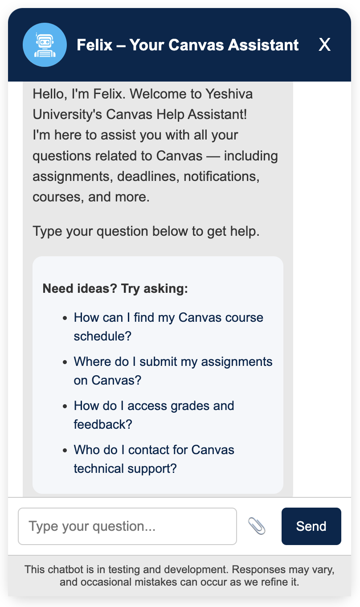
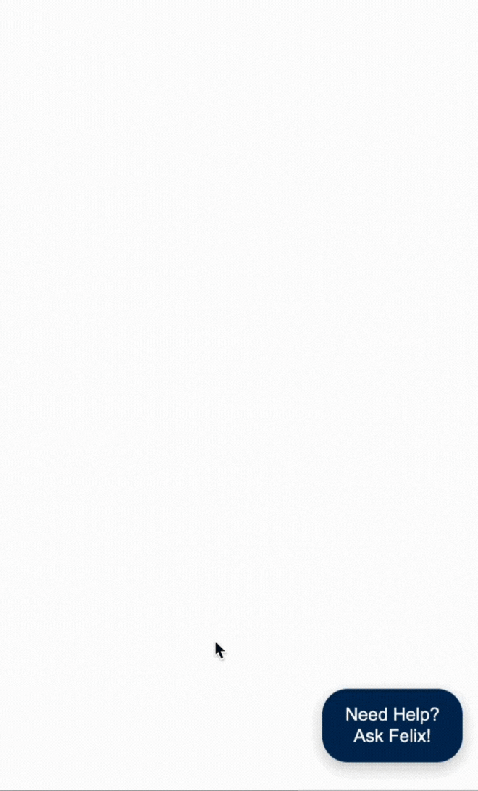

# YU Canvas-Chatbot
<!--
  README for Canvas Chatbot
-->
<h1><center>Canvas Chatbot - <b>FELIX</b></center></h1>

<p align="center">
  
  
</p>

## Overview
The Canvas Chatbot is a Retrieval-Augmented Generation (RAG) assistant for Yeshiva University students. It delivers instant, contextually relevant answers on Canvas navigation, course materials, and related resources through a friendly chat interface.

## Features
- Natural Language Q&A
- Direct links to course documents (syllabi, assignments, readings)
- Integration with:
  - Pre-built FAQs
  - Canvas course content (Graduate & Undergraduate)
  - Scraped career resources (Undergraduate only)
- Feedback mechanism (thumbs-up/down) to improve response quality
- End-to-end deployment on Azure (Web App & Functions)

## Tech Stack
- Python 3.11+
- Flask (Web API & UI)
- LangChain, ChromaDB (semantic retrieval)
- OpenAI GPT-4 Turbo (or GPT-3.5) for language understanding
- Azure Functions & Terraform for data ingestion and infrastructure
- Supporting libraries: requests, BeautifulSoup4, PyMuPDF, python-docx, pandas, python-dotenv

## Repository Structure
```
/  
├── Web/                          # Flask web applications
│   ├── app_grad.py               # Graduate chatbot service
│   ├── app_undergrad.py          # Undergraduate chatbot service
│   ├── templates/                # Jinja2 templates (chat UI)
│   ├── static/                   # CSS, JS, images, resources
│   └── faq_scrape_vectorStore/   # Scraped career KB (Undergrad)
├── canvas_knowledgebase/         # Canvas data ingestion & vectorstore builder
├── Canvas_Grad_chromadb_store/   # Graduate Canvas vectorstore data
├── graduate_vectorStore/         # Graduate Canvas vectorstore
├── undergraduate_vectorStore/    # Undergraduate Canvas vectorstore
├── faq_vectorStore/              # FAQ vectorstore data
├── Data Warehouse/               # Azure Functions & Terraform
│   ├── Batch_trigger/            # Batch ingestion Function app
│   ├── daily_trigger_api/        # Daily update Function app
│   ├── helper/                   # Utility modules (DB, email, logging)
│   ├── pgsql/                    # SQL query definitions
│   ├── terraform/                # Terraform modules & configs
│   ├── requirements.txt          # Functions dependencies
│   └── host.json                 # Azure Functions host config
├── KT/                           # Knowledge Transfer docs & scripts
│   ├── Technical_Document.md
│   ├── NonTechnical_Document.md
│   └── generate_docs.py
├── requirements.txt              # Global Python dependencies
└── README.md                     # This file
```

## Prerequisites
- Python 3.11 or later
- Git
- (Optional) Azure CLI & Terraform for deployment

## Installation
1. **Clone the repository**
   ```bash
   git clone <repository_url>
   cd <repository_folder>
   ```
2. **Create and activate a virtual environment**
   ```bash
   python3 -m venv venv
   source venv/bin/activate   # Windows: venv\Scripts\activate
   ```
3. **Install global dependencies**
   ```bash
   pip install -r requirements.txt
   ```
4. **Configure environment variables**
- Create `.env` in project root:
  ```ini
  OPENAI_API_KEY=<your_openai_key>
  CHATBOT_ENV=dev   # dev | staging | production
  ```
- For Azure Functions, create `local.settings.json` in `Data Warehouse/`:
  ```json
  {
    "IsEncrypted": false,
    "Values": {
      "AzureWebJobsStorage": "<connection_string>",
      "FUNCTIONS_WORKER_RUNTIME": "python",
      "AUTH_KEY1": "<api_auth_key>",
      "DATABASE_URL": "<postgres_connection_string>"
    }
  }
  ```

## Local Development
### Run Web Chatbot
```bash
# Graduate chatbot
export OPENAI_API_KEY=<your_openai_key>
python Web/app_grad.py

# Undergraduate chatbot
python Web/app_undergrad.py

# Access: http://127.0.0.1:5000/
```
### Generate KT Documents
```bash
cd KT
python generate_docs.py
# Outputs: Technical_Document.docx, NonTechnical_Document.docx
```
### Build/Update Knowledge Base
```bash
cd canvas_knowledgebase
pip install -r requirements.txt
python create_knowledge_base.py
# Copy or link generated vectorstore to Web/ or faq_vectorStore/
```
### Run Azure Functions Locally
```bash
cd "Data Warehouse"
pip install -r requirements.txt
func start   # Requires Azure Functions Core Tools
```

## Deployment
### Flask Web App
- Deploy the `Web/` folder to an Azure Web App or a WSGI host (e.g., Gunicorn).
- Configure environment variables in the App Service settings.
### Azure Functions & Infrastructure
```bash
cd "Data Warehouse/terraform"
terraform init
terraform plan -out plan.out
terraform apply plan.out
```  
```bash
# Deploy Function code
az functionapp deployment source config-zip \
  --name <FunctionAppName> \
  --resource-group <ResourceGroup> \
  --src ../Batch_trigger.zip
```

## Documentation
- [Technical Knowledge Transfer](KT/Technical_Document.md)
- [Non-Technical Knowledge Transfer](KT/NonTechnical_Document.md)

## Contributing
Contributions are welcome! Please open issues or pull requests. Ensure code passes pre-commit checks and includes tests for new features.

## Contacts
=======

>>>>>>> 1518dff (Initial commit)
